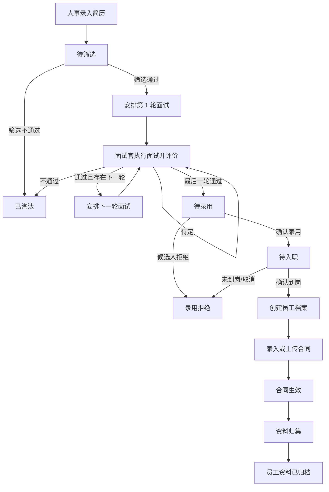
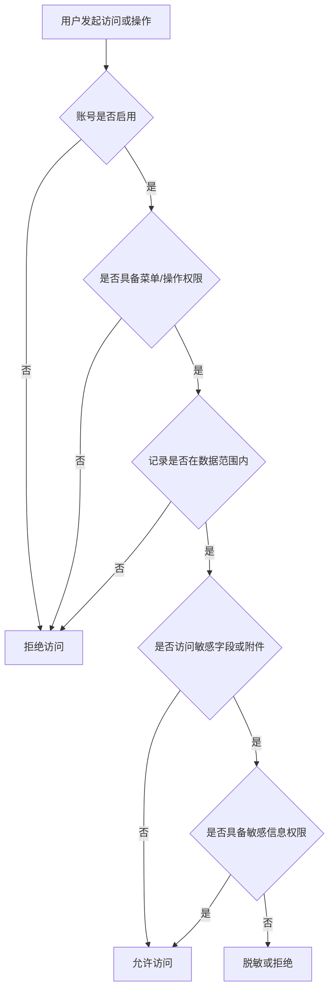

# Tianci OA 产品需求文档（PRD）

> 文档版本：V1.0  
> 产品阶段：MVP  
> 项目正式名称：Tianci OA  
> 前端项目：Tianci-OA-Web  
> 后端项目：Tianci-OA-Api  
> 目标用户：中小企业管理员、人事部门、部门负责人、员工  
> 技术约束：.NET 10 + Vue 3 + TypeScript + Element Plus + MySQL + SqlSugar

## 1. 文档目的

本文档定义 Tianci OA 第一版可开发、可测试、可交付的产品范围，作为后续 UI、技术设计、研发和验收的统一依据。MVP 聚焦企业基础权限、人员档案、招聘、入职、合同及资料归档，不包含财务、采购、库存、生产等复杂 ERP 能力。

## 2. 产品定位

### 2.1 产品定义

Tianci OA 是面向中小企业的人事流程型轻量 OA。系统用一套低部署、低学习和低维护成本的 Web 应用，解决以下核心问题：

- 企业成员、组织、岗位和系统权限缺少统一管理；
- 招聘信息分散，候选人状态、面试过程和评价难以追踪；
- 候选人录用、员工入职、合同签署和资料归档之间存在断点；
- 员工档案、合同附件和简历附件分散存放，查询不便；
- 管理者无法快速了解招聘与入职进展。

### 2.2 产品目标

1. 建立基于角色的访问控制，确保用户只能看到和操作被授权的数据。
2. 建立从简历录入到资料归档的完整招聘转员工链路。
3. 统一管理员工档案、入职信息、合同和附件。
4. 用首页数据概览和招聘看板降低人事人员的日常跟进成本。
5. 保持 MVP 易部署、易使用，优先覆盖高频主流程。

### 2.3 成功标准

- 授权用户可独立完成“简历录入—筛选—多轮面试—录用—入职—合同—归档”全流程。
- 员工和候选人的关键数据均可查询，流程状态清晰且可追溯。
- 无对应权限的用户不能访问菜单、按钮、接口或超出数据范围的记录。
- 关键附件可上传、下载和关联到业务记录。
- 首页能呈现招聘、入职和合同待办的核心数据。

### 2.4 设计原则

- MVP 优先：仅实现主流程所需能力。
- 状态驱动：业务操作必须遵循明确的状态流转。
- 单一数据源：候选人确认入职后生成员工档案，避免重复录入。
- 权限闭环：菜单权限、操作权限和数据权限同时生效。
- 低成本：先采用站内待办和列表筛选，不在 MVP 内引入复杂工作流引擎及外部消息渠道。

## 3. 用户角色分析

### 3.1 角色定义

| 角色 | 主要诉求 | 典型职责 |
|---|---|---|
| 超级管理员 | 完成系统初始化并保障访问安全 | 维护用户、角色、权限、菜单、组织及全局配置 |
| 人事专员 | 高效完成招聘、入职、合同和档案管理 | 录入简历、推进候选人、安排面试、办理入职、维护员工及合同 |
| 部门负责人 | 参与本部门招聘决策并查看本部门人员 | 筛选候选人、参与面试、填写评价、查看本部门员工 |
| 面试官 | 快速查看本人面试任务并提交评价 | 查看被安排的面试、填写评分、备注和结论 |
| 普通员工 | 查看被授权的个人信息 | 查看本人基础档案、入职和合同摘要；下载本人可见附件 |

### 3.2 数据可见范围

系统预置三类数据范围，并允许角色绑定：

- 全部数据：可查看企业范围内数据；
- 本部门及下级部门：可查看所在部门及其下级部门数据；
- 仅本人：仅可查看与本人关联的数据或本人待办。

若用户拥有多个角色，功能权限取并集；数据范围按最大授权范围计算。涉及身份证、薪资、合同附件等敏感信息时，仍需额外的字段或操作权限，不能仅凭数据范围放开。

## 4. MVP 范围与优先级

### 4.1 MVP 功能模块

| 一级模块 | 二级功能 | MVP 能力 | 优先级 |
|---|---|---|---|
| 首页 | 数据概览 | 简历总数、待筛选、面试中、已入职、合同即将到期 | P0 |
| 首页 | 流程与趋势 | 招聘漏斗、近 6 个月入职趋势、待办事项、快捷入口 | P1 |
| 权限管理 | 用户管理 | 查询、新增、编辑、启停、重置密码、绑定角色和员工 | P0 |
| 权限管理 | 角色管理 | 角色增删改查、菜单及操作授权、数据范围授权 | P0 |
| 权限管理 | 权限与菜单 | 菜单树维护、操作权限标识配置 | P0 |
| 组织管理 | 部门与岗位 | 部门树、岗位列表的增删改查和启停 | P0 |
| 人员管理 | 员工档案 | 查询、新增、编辑、离职、查看详情、档案归档 | P0 |
| 招聘管理 | 简历管理 | 简历录入、附件上传、编辑、筛选、淘汰、详情查询 | P0 |
| 招聘管理 | 面试管理 | 动态轮次、安排面试、面试官、时间地点、评价与结论 | P0 |
| 招聘管理 | 招聘看板 | 按状态分栏查看候选人并进入详情或推进操作 | P1 |
| 入职管理 | 确认入职 | 录用候选人、维护入职日期、部门、岗位、薪资、试用期、材料 | P0 |
| 合同管理 | 合同档案 | 新增、编辑、查询、附件上传、到期提醒、归档 | P0 |
| 资料中心 | 业务归档 | 将简历、面试、入职、合同资料归集到员工档案 | P0 |
| 审计 | 操作日志 | 记录关键新增、修改、状态变更和附件操作 | P1 |

### 4.2 MVP 明确不包含

- 薪资核算、个税、社保、公积金和工资条；
- 考勤、排班、请假、加班和复杂审批流；
- 财务报销、采购、库存、生产和客户关系管理；
- 招聘网站自动抓取、人才库智能推荐和 AI 简历解析；
- 电子签章及具有法律效力的在线签约；
- 短信、邮件、企业微信、钉钉等外部通知；
- 多租户计费、集团多法人和跨公司调动；
- 自定义表单设计器、流程编排器及复杂报表平台。

## 5. 功能模块设计

### 5.1 首页

#### 5.1.1 数据概览

- 卡片展示：简历总数、待筛选、面试中、已入职、合同即将到期。
- 招聘漏斗展示：简历投递、筛选通过、面试中、录用/入职数量。
- 入职趋势展示：近 6 个自然月每月入职人数。
- 待办事项展示：待筛选简历、即将开始的面试、待办理入职、即将到期合同。
- 快捷入口：新增简历、安排面试、确认入职、新增合同。
- 统计和待办仅包含当前用户数据权限范围内的数据。

#### 5.1.2 指标口径

- 待筛选：当前状态为“待筛选”的候选人数。
- 面试中：当前状态为“待安排面试”或“面试中”的候选人数。
- 已入职：统计期内入职状态为“在职”的新员工人数。
- 合同即将到期：合同处于“生效中”且结束日期落在提醒天数范围内的合同数。

### 5.2 权限与基础组织

#### 5.2.1 用户管理

- 用户字段：用户名、姓名、手机、邮箱、关联员工、所属部门、状态、角色。
- 支持新增、编辑、启用、停用、重置密码和角色分配。
- 用户停用后不可登录；历史业务记录不得删除。
- 员工离职时，系统提示管理员同步停用其用户账号。

#### 5.2.2 角色、权限与菜单

- 角色字段：角色名称、编码、状态、备注。
- 权限分为菜单查看和操作权限，如 `employee:view`、`employee:edit`、`candidate:interview`。
- 角色配置采用菜单树与操作项勾选。
- 数据范围可选：全部、本部门及下级、仅本人。
- 至少保留一个启用状态的超级管理员，避免系统失去管理入口。

#### 5.2.3 部门与岗位

- 部门采用树结构，字段包括名称、上级部门、负责人、排序、状态。
- 岗位字段包括名称、编码、所属部门、状态、备注。
- 已被员工或业务数据引用的部门、岗位不得物理删除，只能停用。

### 5.3 员工档案

#### 5.3.1 档案字段

- 基础信息：员工编号、姓名、性别、手机、邮箱、身份证号；
- 任职信息：部门、岗位、入职日期、员工状态；
- 入职信息：薪资、试用期、转正日期；
- 资料信息：入职材料、合同、由候选人继承的简历及面试记录；
- 系统信息：创建人、创建时间、更新人、更新时间。

身份证号、薪资默认脱敏展示；仅有敏感字段查看权限的角色可查看完整值。

#### 5.3.2 核心操作

- 列表支持按姓名/员工编号/手机号模糊查询，按部门、岗位、状态筛选。
- 支持新增、编辑和查看详情。
- 离职操作必须填写离职日期，可选填离职原因。
- 归档仅允许对离职员工执行；归档后档案只读，可查询和查看。
- 不提供员工档案物理删除。

### 5.4 招聘管理

#### 5.4.1 简历管理

- 字段：姓名、性别、手机、邮箱、学历、工作经历、技能、应聘岗位、简历来源、简历附件、备注。
- 手机号或邮箱重复时提示可能存在重复候选人，由人事决定继续保存或返回修改。
- 支持新建、编辑、查看详情、筛选通过、淘汰。
- 淘汰必须填写原因；淘汰记录保留，具备权限的人员可重新激活至待筛选。

#### 5.4.2 面试管理

- 每个应聘岗位可设置面试轮次，MVP 默认 2 轮，允许 1 至 5 轮。
- 每轮字段：轮次、面试官、面试时间、面试地点、评分、评价备注、结论、下轮安排。
- 安排面试后，该候选人进入“待安排面试/面试中”链路；面试官产生站内待办。
- 面试完成时必须填写评分、评价和结论。
- 结论为“通过”且仍有下一轮时进入下一轮待安排；最后一轮通过后进入“待录用”。
- 结论为“不通过”时进入“已淘汰”；“待定”保持当前面试轮次并允许后续修改结论。

#### 5.4.3 招聘看板

- 默认分栏：简历投递/待筛选、面试邀约、面试中、待录用、已入职。
- 顶部支持应聘岗位、日期范围筛选和关键字搜索。
- 卡片显示候选人姓名、岗位、当前轮次、下一节点时间及负责人。
- 点击卡片在右侧打开候选人详情抽屉，页签包括基本信息、面试记录、入职信息、合同信息和附件。
- MVP 中看板仅支持查看和从详情中执行推进操作，不实现自由拖拽改变状态，避免绕过业务校验。

### 5.5 入职管理

- 仅“待录用”候选人可发起确认录用。
- 录用信息：拟入职日期、部门、岗位、月薪、试用期、备注。
- 录用确认后状态为“待入职”；实际到岗时执行“确认入职”。
- 确认入职前必须填写实际入职日期、部门、岗位、试用期，并上传已配置为必需的入职材料。
- 确认入职后自动创建员工档案并关联原候选人、简历、面试记录和附件。
- 同一候选人只能创建一个有效员工档案；失败时不得部分生成数据。
- 候选人在到岗前拒绝录用，可标记“录用拒绝”并填写原因。

### 5.6 合同管理

- 字段：合同编号、员工、合同类型、开始日期、结束日期、提醒天数、合同附件、备注。
- 合同类型 MVP 预置：劳动合同、实习协议、保密协议、其他。
- 合同编号在系统内唯一。
- 开始日期不得晚于结束日期。
- 到期提醒天数默认 30 天，可在新增/编辑时调整。
- 支持草稿保存、生效、终止、续签和归档。
- 续签通过新增一份合同并关联原合同实现，原合同保留历史。
- 合同附件上传不等同于电子签署；MVP 只管理扫描件或文件。

### 5.7 文件与归档

- 支持简历附件、入职材料和合同附件上传、下载。
- 允许的文件类型在系统配置中限定；MVP 建议 PDF、DOC、DOCX、JPG、PNG。
- 单文件大小建议不超过 20 MB，具体部署值由技术实现确认。
- 业务记录归档后附件仍可下载，不允许被普通用户删除。
- 文件操作需校验业务记录数据权限和附件操作权限。

### 5.8 操作日志

记录以下关键事件：登录、用户启停、权限修改、员工编辑/离职/归档、候选人状态变更、面试评价、确认入职、合同状态变更、附件上传/删除/下载。日志至少包含操作人、时间、对象、动作、结果和必要的变更摘要，普通业务用户不可修改日志。

## 6. 页面结构设计

### 6.1 全局布局

参考草图采用后台管理系统布局：

- 左侧：深色主导航，支持折叠；
- 顶部：面包屑、全局搜索入口、当前用户及退出；
- 中部：页面主体；
- 详情查看：优先使用右侧抽屉，减少列表上下文丢失；
- 新增/编辑：字段较少时使用对话框，字段较多或存在多分组时使用独立页面；
- 页面操作按钮根据权限动态显示，后端接口仍必须独立鉴权。

### 6.2 导航结构

```text
首页
人员管理
├─ 员工档案
├─ 组织架构
└─ 岗位管理
招聘管理
├─ 招聘看板
├─ 简历管理
├─ 面试安排
└─ 面试记录
入职管理
├─ 待入职
└─ 入职办理
合同管理
├─ 合同列表
└─ 到期提醒
资料中心
├─ 待归档
└─ 已归档
系统管理
├─ 用户管理
├─ 角色管理
├─ 菜单权限
└─ 操作日志
```

### 6.3 关键页面

| 页面 | 核心区域 | 关键操作 |
|---|---|---|
| 登录页 | 用户名、密码、登录按钮 | 登录、显示校验错误 |
| 首页 | 指标卡、漏斗、趋势、待办、快捷入口 | 查看明细、进入办理 |
| 员工档案列表 | 查询区、数据表格、分页 | 新增、编辑、详情、离职、归档 |
| 员工详情 | 基础信息、任职信息、简历/面试、入职、合同、附件 | 编辑、下载附件 |
| 招聘看板 | 筛选区、状态分栏、候选人卡片、最近面试 | 打开详情、推进流程 |
| 简历录入 | 基础信息、应聘信息、附件、备注 | 保存、取消 |
| 安排面试 | 候选人、岗位、轮次、面试官、时间、地点 | 保存、取消 |
| 面试评价 | 候选人、面试官、星级/分数、评价、结论、下轮时间 | 提交、保存 |
| 确认入职 | 候选人、日期、部门、岗位、薪资、试用期、材料 | 保存、确认入职 |
| 合同列表 | 查询区、状态标签、到期标识、分页 | 新增、编辑、生效、续签、终止、归档 |
| 合同编辑 | 员工、类型、编号、起止日期、提醒、附件 | 保存草稿、生效 |
| 用户/角色 | 用户表格、角色列表、权限树、数据范围 | 保存授权、启停 |

## 7. 页面交互说明

### 7.1 通用交互

- 查询条件点击“查询”后生效；“重置”恢复默认条件并重新加载第一页。
- 列表默认按更新时间倒序，分页大小默认 20 条。
- 保存操作期间按钮进入加载状态，防止重复提交。
- 表单离开前若存在未保存修改，应提示用户确认。
- 必填项在标签前显示星号；校验失败时定位到首个错误字段。
- 成功操作展示轻提示，失败操作展示可理解的业务原因，不直接暴露服务端堆栈。
- 停用、淘汰、离职、终止、归档等高影响操作必须二次确认。
- 空列表展示空状态和有权限用户的快捷新增入口。

### 7.2 列表与详情

- 姓名、编号等关键列可点击打开右侧详情抽屉。
- 状态统一以有文本的标签呈现，不能仅依赖颜色区分。
- 敏感字段默认脱敏；点击查看完整值时重新校验权限。
- 附件上传显示进度、成功/失败状态；上传失败不应导致其他表单内容丢失。

### 7.3 招聘流程交互

- 每个候选人详情顶部显示当前状态、当前轮次和下一可执行动作。
- 页面仅显示当前状态允许的操作，例如面试未完成前不显示“确认录用”。
- 面试评价提交后原则上不可直接覆盖；具备修正权限的用户可更正，并保留操作日志。
- 状态推进失败时保持原状态，避免出现半完成业务数据。

### 7.4 草图关键交互落地

- 首页卡片点击后跳转到已带对应筛选条件的业务列表。
- 招聘漏斗点击某一阶段后进入该阶段的候选人列表。
- 招聘看板点击候选人卡片打开右侧详情抽屉。
- 详情抽屉页签切换时保留当前候选人上下文。
- 最近面试安排中的“详情”直接打开候选人对应面试详情。
- 快捷入口仅向拥有相应操作权限的用户显示。

## 8. 业务流程图

### 8.1 招聘到归档主流程



### 8.2 权限判定流程



### 8.3 员工离职与归档流程


## 9. 状态流转设计

### 9.1 候选人状态

| 当前状态 | 可执行动作 | 目标状态 | 约束 |
|---|---|---|---|
| 待筛选 | 筛选通过 | 待安排面试 | 必须已选择应聘岗位 |
| 待筛选 | 淘汰 | 已淘汰 | 必填淘汰原因 |
| 待安排面试 | 保存面试安排 | 面试中 | 必填轮次、面试官和时间 |
| 面试中 | 结论：待定 | 面试中 | 必填评价，可后续修正结论 |
| 面试中 | 结论：不通过 | 已淘汰 | 必填评价和淘汰原因 |
| 面试中 | 本轮通过且有下一轮 | 待安排面试 | 自动推进轮次 |
| 面试中 | 最后一轮通过 | 待录用 | 必填评价 |
| 待录用 | 确认录用 | 待入职 | 必填拟入职信息 |
| 待录用 | 候选人拒绝 | 录用拒绝 | 必填原因 |
| 待入职 | 确认到岗 | 已入职 | 必填实际入职信息并创建员工档案 |
| 待入职 | 取消入职 | 录用拒绝 | 必填原因 |
| 已淘汰 | 重新激活 | 待筛选 | 仅授权人事可执行并记日志 |
| 已入职 | 无 | 终态 | 后续由员工状态承接 |

候选人状态禁止通过普通编辑表单直接修改，必须调用对应业务动作。

### 9.2 员工状态

```text
待入职 → 试用 → 在职 → 离职 → 已归档
             ↘
              离职
```

- 确认入职时，根据试用期配置进入“试用”或“在职”。
- 试用期结束由人事执行转正进入“在职”；MVP 不自动转正。
- “试用”或“在职”可办理离职。
- “离职”档案可执行归档，归档后只读。

### 9.3 合同状态

| 当前状态 | 动作 | 目标状态 | 说明 |
|---|---|---|---|
| 草稿 | 编辑 | 草稿 | 可反复保存 |
| 草稿 | 生效 | 生效中 | 必须具备编号、员工、类型、起止日期和附件 |
| 生效中 | 到达结束日期 | 已到期 | 系统按日期计算展示 |
| 生效中 | 终止 | 已终止 | 必填终止日期及原因 |
| 生效中/已到期 | 续签 | 原合同保持；新合同为草稿 | 新合同关联原合同 |
| 已到期/已终止 | 归档 | 已归档 | 归档后只读 |

“即将到期”是提醒标签，不是独立合同状态。

### 9.4 用户状态

```text
启用 ⇄ 停用
```

用户停用不删除历史记录；停用状态下所有登录会话应失效。

## 10. 权限矩阵

图例：`✓` 可操作，`R` 只读，`本部门` 受本部门及下级数据范围限制，`本人` 仅本人关联数据，`—` 默认无权限。角色权限可由超级管理员调整，但不得突破产品规定的敏感信息校验。

| 功能/操作 | 超级管理员 | 人事专员 | 部门负责人 | 面试官 | 普通员工 |
|---|---:|---:|---:|---:|---:|
| 首页统计 | ✓ | ✓ | 本部门 | 本人待办 | 本人 |
| 用户管理 | ✓ | — | — | — | — |
| 角色/菜单/权限管理 | ✓ | — | — | — | — |
| 部门/岗位管理 | ✓ | R | R | R | R |
| 员工档案列表 | ✓ | ✓ | 本部门 | — | — |
| 员工档案新增/编辑 | ✓ | ✓ | — | — | — |
| 员工敏感信息完整查看 | ✓ | ✓ | — | — | 本人可选 |
| 员工离职/归档 | ✓ | ✓ | — | — | — |
| 简历录入/编辑 | ✓ | ✓ | — | — | — |
| 候选人查看 | ✓ | ✓ | 本部门 | 本人被安排 | — |
| 候选人筛选/淘汰 | ✓ | ✓ | 本部门 | — | — |
| 安排面试 | ✓ | ✓ | 本部门 | — | — |
| 提交面试评价 | ✓ | ✓ | 本人被安排 | 本人被安排 | — |
| 查看他人面试评价 | ✓ | ✓ | 本部门 | — | — |
| 确认录用/入职 | ✓ | ✓ | — | — | — |
| 薪资查看 | ✓ | ✓ | — | — | 本人可选 |
| 合同新增/编辑/状态变更 | ✓ | ✓ | — | — | — |
| 合同查看 | ✓ | ✓ | — | — | 本人 |
| 附件上传/删除 | ✓ | ✓ | 按业务授权 | 按本人面试授权 | — |
| 附件下载 | ✓ | ✓ | 按业务授权 | 按本人面试授权 | 本人 |
| 操作日志 | ✓ | R | — | — | — |

## 11. 数据与业务规则

### 11.1 唯一性与必填规则

- 用户名、员工编号、合同编号必须唯一。
- 候选人姓名、联系方式、应聘岗位为简历录入必填项。
- 员工姓名、手机、部门、岗位、入职日期、状态为员工档案必填项。
- 同一个系统用户最多绑定一个有效员工档案。
- 同一候选人最多对应一个有效员工档案。

### 11.2 删除与留痕

- 用户、员工、候选人、面试、合同等核心业务数据不提供物理删除。
- 未进入业务流程且无引用的草稿可删除；删除应记录操作日志。
- 业务状态变更必须记录操作人、时间、原状态、目标状态及备注。

### 11.3 提醒规则

- 面试提醒：出现在相关面试官及人事的首页待办。
- 待入职提醒：拟入职日期临近时出现在人事首页待办。
- 合同提醒：结束日期减提醒天数起，在首页和合同列表标红展示。
- MVP 仅提供站内提醒，不承诺消息推送到外部渠道。

## 12. 验收边界

### 12.1 MVP 通过条件

#### 权限与组织

- 能创建部门、岗位、用户和角色，并完成菜单、操作和数据范围授权。
- 停用用户不能登录；无权限用户无法通过页面或接口越权操作。
- 部门负责人只能查看授权数据范围内的候选人和员工。

#### 员工档案

- 人事能查询、新增、编辑和查看员工档案。
- 人事能将试用员工转正、将试用/在职员工办理离职，并归档离职档案。
- 归档档案只读，敏感字段对无权限角色脱敏。

#### 招聘与面试

- 人事能录入简历并上传附件。
- 候选人可从待筛选按规则推进至面试、待录用、待入职和已入职。
- 面试轮次可在 1 至 5 轮内配置，面试官只能提交本人被安排场次的评价。
- 面试不通过、候选人拒绝和取消入职均能记录原因并保留历史。
- 招聘看板、详情抽屉和列表状态保持一致。

#### 入职与合同

- 确认入职可一次性创建员工档案并关联原招聘资料，重复确认会被拦截。
- 能新增合同、上传附件、设置到期提醒并完成生效、终止、续签、归档。
- 首页和合同列表能正确识别提醒期内合同。

#### 首页与归档

- 首页统计只计算用户有权限查看的数据，点击指标能进入对应筛选列表。
- 简历、面试、入职和合同资料可从员工详情中关联查看。
- 关键业务操作有日志可追溯。

### 12.2 不作为 MVP 验收阻塞项

- 草图像素级还原、复杂大屏、图表自定义配置；
- 拖拽招聘看板改变状态；
- 外部邮件、短信、企业微信或钉钉通知；
- 第三方招聘网站集成、OCR、AI 简历解析；
- 电子签章、合同在线签署；
- 薪资核算、考勤、审批中心和复杂工作流；
- Excel 批量导入导出、复杂打印模板和自定义报表；
- 移动端 App 或小程序。

### 12.3 质量边界

- PC Web 端优先，支持主流现代浏览器；MVP 不承诺移动端完整适配。
- 业务保存、状态推进和确认入职应具备防重复提交能力。
- 所有接口均需登录鉴权，受保护业务接口需同时校验操作权限和数据权限。
- 业务异常不得造成候选人状态、员工档案和合同等数据部分成功。
- 系统提示需面向业务用户表达，不展示数据库或服务端内部错误。

## 13. 非功能要求

### 13.1 易用性

- 常用任务尽量在三次页面跳转内完成。
- 统一状态颜色、操作名称、确认提示和表单校验规则。
- 页面默认筛选与排序贴合人事人员的日常待办优先级。

### 13.2 性能

- 常规列表在合理数据量和分页条件下目标响应时间不超过 2 秒。
- 首页统计与图表应一次加载或分区并行加载，单区失败不阻塞其他区域展示。
- 附件上传展示进度，避免大文件阻塞表单操作。

### 13.3 安全

- 密码不得明文存储或返回。
- 身份证号、薪资、合同等敏感信息按权限展示并记录关键访问日志。
- 文件下载使用受控访问，不暴露可长期匿名访问的真实存储地址。
- 服务端不信任前端传入的数据范围，必须根据当前用户重新计算权限。

### 13.4 可维护性

- 业务状态和权限标识需统一定义，避免页面和接口各自维护不同口径。
- 关键字典如性别、员工状态、合同类型采用可维护的基础配置或统一常量。
- 日志能定位关键操作，但不得记录密码等敏感明文。

## 14. 后续扩展

以下能力按业务价值逐步评估，不进入当前 MVP：

### 14.1 人事效率

- Excel 批量导入/导出员工及候选人；
- 候选人重复识别与人才库；
- 招聘渠道、岗位编制和转化率分析；
- 转正提醒、生日提醒、证件到期提醒；
- 员工调岗、调薪及完整人事异动记录。

### 14.2 流程与协同

- 可配置审批中心；
- Offer 审批、入职审批、合同审批；
- 邮件、短信、企业微信、钉钉、飞书通知；
- 面试日历和外部日历同步；
- 自定义面试评价模板。

### 14.3 合同与文档

- 合同模板生成、在线预览和批量续签；
- 合规电子签章服务接入；
- 文件版本管理、水印、访问有效期；
- 对象存储和病毒扫描。

### 14.4 员工自助与管理分析

- 员工自助维护个人资料和提交证明；
- 移动端或小程序；
- 组织人力趋势、招聘漏斗、离职分析；
- 自定义仪表盘与报表导出。

### 14.5 平台化

- 多租户与企业订阅计费；
- 多法人、多组织隔离；
- 开放 API、Webhook 和单点登录；
- 国际化与多时区。

## 15. 项目命名约束

- 对外产品名和所有业务文档统一使用 **Tianci OA**。
- 前端工程统一使用 **Tianci-OA-Web**。
- 后端工程统一使用 **Tianci-OA-Api**。
- 页面标题、系统 Logo 文案、接口文档和部署说明不得再使用“低成本企业 OA 系统”作为正式项目名；该词仅可作为产品定位描述。

