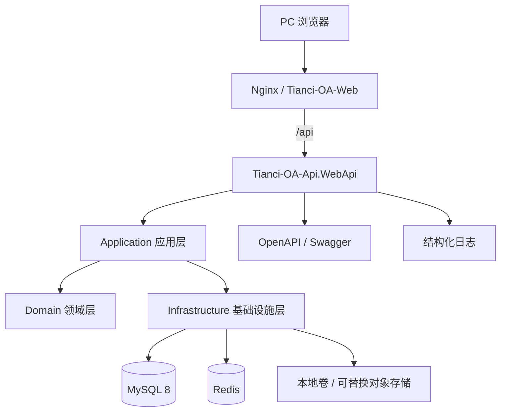
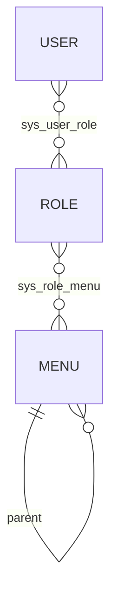
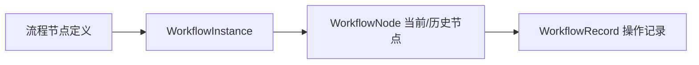
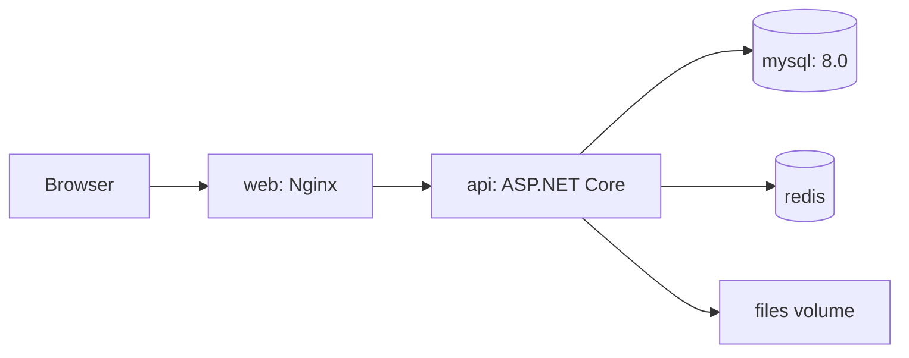

# Tianci OA 技术架构设计

> 版本：V1.0  
> 输入：`01-产品需求文档.md`  
> 前端：`Tianci-OA-Web`  
> 后端：`Tianci-OA-Api`

## 1. 架构目标与原则

Tianci OA 采用前后端分离的模块化单体架构。MVP 不引入微服务、消息队列和完整 ABP 框架，以较低部署与运维成本实现清晰分层、模块隔离、统一鉴权、事务一致性和后续水平扩展能力。

- 后端：.NET 10 Web API、SqlSugar、MySQL 8、Redis、JWT、Swagger。
- 前端：Vue 3、TypeScript、Vite、Element Plus、Pinia、Vue Router。
- 部署：Docker Compose，包含 Web、API、MySQL、Redis。
- 业务主键：雪花 ID，以字符串形式输出给 JavaScript，避免 64 位整数精度丢失。
- 核心数据：逻辑删除或状态归档，不物理删除已进入业务流程的数据。

## 2. 系统总体架构



### 2.1 调用规则

```text
WebApi → Application → Domain
WebApi → Infrastructure（仅依赖注入注册）
Infrastructure → Application/Domain 中定义的抽象
Domain → 无外部项目依赖
```

禁止 Controller 直接访问数据库；禁止 Domain 依赖 SqlSugar、Redis、HTTP 或文件系统。

## 3. 后端解决方案结构

```text
Tianci-OA-Api/
├─ Tianci.OA.sln
├─ src/
│  ├─ Tianci.OA.Domain/
│  │  ├─ Common/            # BaseEntity、枚举、领域异常
│  │  ├─ Identity/
│  │  ├─ Organization/
│  │  ├─ Employees/
│  │  ├─ Recruitment/
│  │  ├─ Contracts/
│  │  ├─ Workflows/
│  │  └─ Files/
│  ├─ Tianci.OA.Application/
│  │  ├─ Abstractions/      # 当前用户、仓储、缓存、文件、时钟
│  │  ├─ Common/            # DTO、分页、统一业务结果
│  │  └─ Modules/           # 各模块 Service 与 DTO
│  ├─ Tianci.OA.Infrastructure/
│  │  ├─ Persistence/       # SqlSugar、仓储、事务、种子数据
│  │  ├─ Authentication/    # JWT、密码哈希
│  │  ├─ Authorization/     # 权限/数据范围实现
│  │  ├─ Caching/           # Redis
│  │  ├─ Files/             # 本地文件存储
│  │  └─ Logging/
│  └─ Tianci.OA.WebApi/
│     ├─ Controllers/
│     ├─ Authorization/
│     ├─ Middleware/
│     ├─ Extensions/
│     └─ Program.cs
├─ tests/
│  ├─ Tianci.OA.UnitTests/
│  └─ Tianci.OA.IntegrationTests/
├─ database/
├─ docker-compose.yml
└─ README.md
```

## 4. 业务模块边界

| 模块 | 主要职责 | 关键对象 |
| --- | --- | --- |
| Identity | 登录、用户、角色、菜单、权限、数据范围 | User、Role、Menu、UserRole、RoleMenu |
| Organization | 部门树与岗位 | Department、Position |
| Employee | 员工档案、离职、归档、入职记录 | Employee、EmployeeEntry |
| Recruitment | 简历、筛选、多轮面试、录用 | Resume、InterviewRecord |
| Contract | 合同、提醒、续签、归档 | EmployeeContract |
| Workflow | 招聘/审批的流程实例、节点、记录 | WorkflowInstance、WorkflowNode、WorkflowRecord |
| File | 受控上传、下载和业务附件关联 | SysFile |
| Audit | 登录与关键业务操作留痕 | OperationLog |
| Dashboard | 权限范围内聚合统计与待办 | 只读查询模型 |

模块间通过 Application Service 协作。确认入职由 Employee 应用服务协调 Recruitment、Employee、Workflow 与 File 关联，并在同一数据库事务中完成。

## 5. API 契约

### 5.1 路由与版本

- 基础路径：`/api/v1`
- 资源命名：复数名词，如 `/employees`、`/resumes`。
- 业务动作：`POST /resumes/{id}/screen-pass`、`POST /employees/{id}/terminate`。
- 分页参数：`pageNumber`（从 1 开始）、`pageSize`（默认 20，最大 100）。
- 日期时间：API 使用 ISO 8601；数据库统一存 UTC，前端按本地时区展示。

### 5.2 统一响应

```json
{
  "success": true,
  "code": "OK",
  "message": "操作成功",
  "data": {},
  "traceId": "..."
}
```

分页 `data` 统一为：

```json
{
  "items": [],
  "pageNumber": 1,
  "pageSize": 20,
  "total": 0
}
```

HTTP 状态码保持语义：400 参数/业务校验、401 未登录、403 无权限、404 不存在、409 状态冲突或重复、413 文件过大、500 未处理异常。

## 6. 认证与权限设计

### 6.1 JWT

- 登录成功签发短期 Access Token；MVP 默认 2 小时。
- Claim 最少包含 `sub`（用户 ID）、`name`、`jti`。
- 权限和数据范围以服务端当前数据为准，不把完整权限作为长期可信 Claim。
- 用户停用、密码重置或角色变更时提升用户 `security_stamp`，使旧会话失效。
- 密码使用 ASP.NET Core PasswordHasher（PBKDF2）存储，禁止明文或可逆加密。

### 6.2 RBAC



`sys_menu` 同时承载目录、菜单、按钮权限，按钮记录具有唯一权限编码，例如：

- `employee:view`、`employee:create`、`employee:edit`、`employee:terminate`
- `resume:view`、`resume:create`、`resume:interview`
- `contract:view`、`contract:manage`
- `system:user`、`system:role`、`system:menu`

后端使用策略或权限特性校验，前端权限指令只用于显示控制，不能替代接口鉴权。

### 6.3 数据权限

角色数据范围：`All`、`DepartmentAndChildren`、`Self`。多个角色取最大范围。查询服务根据当前用户计算允许的部门或本人 ID，并将条件追加到 SqlSugar 表达式；详情、编辑、下载同样执行数据范围校验。

身份证、薪资、合同附件等敏感字段再校验独立权限。无权限时服务端直接返回脱敏字段或拒绝访问。

## 7. 轻量工作流

MVP 使用“领域状态机 + 通用流程记录”，不实现可视化流程引擎。



- `WorkflowInstance`：业务类型、业务 ID、当前节点、状态、版本号。
- `WorkflowNode`：节点编码、名称、顺序、审批模式和状态。
- `WorkflowRecord`：原节点、目标节点、动作、操作人、意见、时间。
- 招聘状态推进必须通过应用服务动作，校验当前状态后原子更新。
- 使用版本号实现乐观并发；重复提交采用请求幂等键或“当前状态 + 目标状态”检查。
- 审批失败时事务回滚，状态和流程记录不能部分成功。

## 8. 数据访问与事务

- SqlSugar 使用 Scoped `ISqlSugarClient`。
- 简单 CRUD 使用通用仓储；复杂列表与统计允许查询服务直接使用数据库抽象，避免僵化仓储。
- 写操作由 Application Service 控制事务边界。
- 默认逻辑删除字段：`is_deleted`、`deleted_at`、`deleted_by`。
- 审计字段：`created_at`、`created_by`、`updated_at`、`updated_by`。
- 所有外部 ID 在 JSON 中序列化为字符串。
- 列表必须分页，排序字段采用白名单，禁止拼接任意 SQL。

## 9. 文件上传与访问

### 9.1 方案

定义 `IFileStorage`，MVP 提供本地卷实现，后续可替换 MinIO/S3：

```text
上传流 → 大小检查 → 扩展名/MIME/文件头检查 → 随机存储名
       → 写入隔离目录 → 记录 sys_file → 绑定业务对象
```

- 允许 PDF、DOC、DOCX、JPG、PNG，默认最大 20 MB。
- 存储名使用雪花 ID/随机名，原文件名仅作为元数据。
- 文件保存在 Web 根目录之外，禁止静态匿名访问和路径穿越。
- 下载通过受鉴权 API，先校验业务权限和数据范围。
- 不执行上传文件；响应设置安全的 `Content-Type` 与 `Content-Disposition`。
- 数据库事务失败后清理临时文件；定时清理超时孤儿文件。

## 10. Redis 缓存

Redis 不是核心数据源，故障时业务可降级：

| 场景 | Key 示例 | TTL/失效 |
| --- | --- | --- |
| 用户权限 | `oa:perm:user:{id}` | 10 分钟；角色/菜单变更主动删除 |
| 部门树 | `oa:org:tree` | 30 分钟；组织变更删除 |
| 字典/菜单 | `oa:dict:{type}` | 30 分钟；配置变更删除 |
| 登录失败限流 | `oa:login:fail:{account}:{ip}` | 15 分钟 |
| 幂等键 | `oa:idempotency:{user}:{key}` | 5 分钟 |

缓存采用 Cache-Aside；Key 带固定前缀和环境名；避免缓存身份证号、薪资和合同正文。

## 11. 日志与审计

- 应用日志：结构化输出时间、级别、TraceId、用户 ID、路径、耗时、状态码。
- 审计日志：记录关键业务对象、动作、结果、原/新状态与必要摘要。
- 禁止记录密码、Token、身份证完整值、薪资明文和文件内容。
- 每个请求由中间件生成/透传 `X-Trace-Id`。
- 健康检查：`/health/live` 与 `/health/ready`；就绪检查覆盖 MySQL，Redis 为可选降级项。

## 12. 异常处理

全局异常中间件统一映射：

| 异常 | HTTP | 示例错误码 |
| --- | --- | --- |
| ValidationException | 400 | `VALIDATION_ERROR` |
| BusinessException | 400/409 | `INVALID_STATE_TRANSITION` |
| UnauthorizedAccessException | 401 | `UNAUTHORIZED` |
| ForbiddenException | 403 | `FORBIDDEN` |
| NotFoundException | 404 | `NOT_FOUND` |
| 未知异常 | 500 | `INTERNAL_ERROR` |

生产环境不返回堆栈和数据库信息；详细异常只进入服务端日志并关联 TraceId。

## 13. 前端架构

```text
Tianci-OA-Web/src/
├─ api/               # 按模块封装请求
├─ assets/
├─ components/        # 通用组件
├─ directives/        # 权限指令
├─ layouts/           # 侧栏、顶栏、标签页
├─ router/            # 静态与动态路由、守卫
├─ stores/            # auth、permission、tabs、app
├─ types/
├─ utils/             # request、日期、脱敏等
└─ views/
   ├─ dashboard/
   ├─ employee/
   ├─ recruitment/
   ├─ contract/
   └─ system/
```

- Axios 拦截器注入 Token、TraceId，统一处理响应和 401。
- Pinia 只保存会话、权限、标签和必要 UI 状态，不复制全部服务端数据。
- 路由守卫校验登录，动态路由根据菜单生成；按钮按权限编码控制。
- 草图的深色侧栏、浅色内容区、指标卡、看板和详情抽屉作为视觉基线。

## 14. Swagger 与接口治理

- Swagger 展示 JWT Bearer 认证、DTO 校验和错误响应。
- Controller 使用 XML 注释/摘要与明确的响应类型。
- 开发环境默认开放；生产环境通过配置控制访问或只允许内网。
- 破坏性接口变更必须提升 API 版本，不在同版本静默改变字段语义。

## 15. Docker 部署



Compose 服务：

- `web`：构建 Vue 静态资源，Nginx 代理 `/api`。
- `api`：运行 ASP.NET Core，挂载文件卷，非 root 用户。
- `mysql`：持久卷、UTF8MB4、健康检查。
- `redis`：持久化按环境决定，设置密码。

密钥、数据库密码、JWT Secret 不提交仓库，通过 `.env` 或部署平台 Secret 注入。数据库与 Redis 不对公网暴露。启动顺序使用健康检查，正式环境建议在独立迁移任务中执行 SQL。

## 16. 非功能指标

- 常规分页查询目标 P95 小于 2 秒。
- 10 万员工数据量下仍使用索引和分页，禁止全表返回。
- API 进程保持无状态，可增加实例；文件存储迁移到共享对象存储后可水平扩容。
- 关键写操作具备事务、防重复提交和审计记录。
- 依赖故障：Redis 可降级；MySQL 不可用时就绪检查失败；文件失败不提交业务绑定。

## 17. 架构决策摘要

| 决策 | 选择 | 原因 |
| --- | --- | --- |
| 系统形态 | 模块化单体 | MVP 成本低、事务简单、模块仍可拆分 |
| 分层 | Domain/Application/Infrastructure/WebApi | 明确依赖与测试边界 |
| 工作流 | 状态机 + 流程记录 | 满足招聘与简单审批，避免引擎过度设计 |
| 主键 | 雪花 ID | 非自增、适合未来分布式扩展 |
| 文件 | 抽象存储 + 本地卷实现 | 低成本且可迁移对象存储 |
| 权限 | RBAC + 数据范围 + 敏感操作权限 | 覆盖菜单、按钮、接口与行级数据 |
| 缓存 | Redis Cache-Aside，可降级 | 加速权限与组织读取，不影响数据真实性 |
| 部署 | Docker Compose | 适合中小企业单机或小规模部署 |

