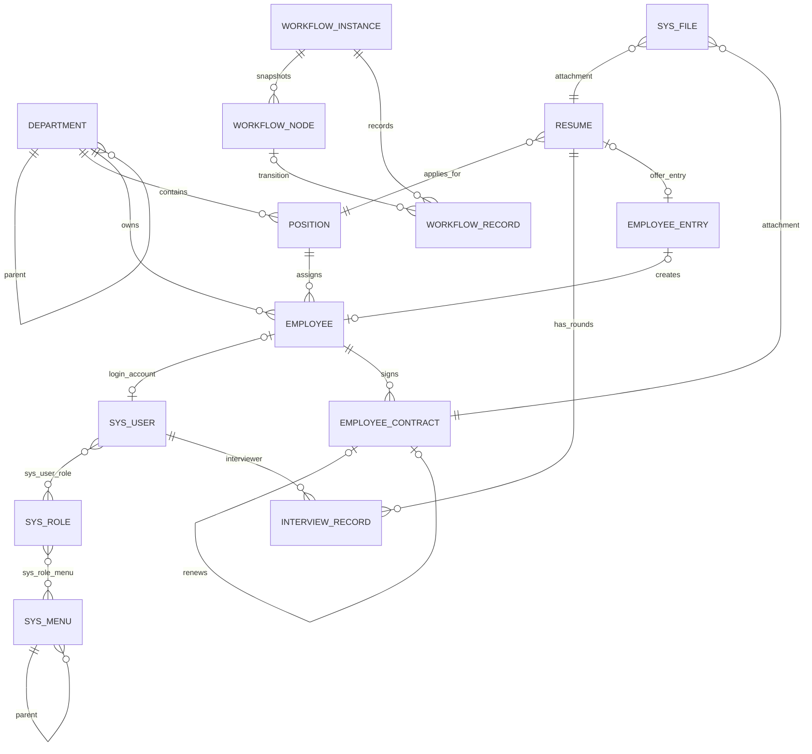

# Tianci OA 数据库设计

> 版本：V1.0
>
> 数据库：MySQL 8.0，`utf8mb4_0900_ai_ci`
>
> ORM：SqlSugar
>
> 初始化脚本：`Tianci-OA-Api/database/init.sql`

## 1. 设计结论

- 所有业务主键均为 `bigint unsigned` 雪花 ID，由后端生成；绝不使用 `AUTO_INCREMENT`。API 向 JavaScript 输出 ID 时必须序列化为字符串。
- 数据库存储 UTC；时间点使用 `datetime(3)`，纯业务日期使用 `date`。连接建立后设置 `time_zone='+00:00'`。
- 可维护实体统一使用逻辑删除与审计字段：`is_deleted`、`deleted_at`、`deleted_by`、`created_at`、`created_by`、`updated_at`、`updated_by`。
- 关系表与只追加日志按其生命周期精简：关系表保留创建审计；`operation_log`、`workflow_record` 只追加，不允许普通业务更新或删除。
- 身份证号、月薪只保存应用层加密后的密文。密码仅保存 ASP.NET Core `PasswordHasher` 产生的 PBKDF2 格式结果，禁止明文、可逆加密和日志记录。
- `sys_file.business_type + business_id`、工作流业务键采用受控多态关联，应用服务负责校验目标对象；其余稳定关系使用数据库外键。

## 2. ER 关系



`department.leader_employee_id` 与 `sys_user.employee_id` 是循环依赖，脚本在 `employee` 建表后幂等添加外键。附件还可通过 `sys_file.business_type/business_id/category` 关联多个入职材料，而不为每种材料增加一张关系表。多态键不能建立跨表外键，因此上传、下载、归档均须在应用服务中校验业务对象存在性和数据权限。

## 3. 表与关键字段

| 表 | 用途 | 关键字段与约束 |
|---|---|---|
| `sys_user` | 登录账号 | `username` 唯一；可一对一关联员工；`password_hash` 可空仅用于待初始化账号 |
| `sys_role` | RBAC 角色 | `code` 唯一；`data_scope` 定义数据范围；系统角色不可删除 |
| `sys_menu` | 目录、菜单、按钮权限 | 自关联树；非空 `permission_code` 唯一 |
| `sys_user_role` | 用户角色 | `(user_id, role_id)` 唯一 |
| `sys_role_menu` | 角色权限 | `(role_id, menu_id)` 唯一 |
| `department` | 部门树 | `code` 唯一；`parent_id` 自关联；负责人引用员工 |
| `position` | 岗位 | `code` 唯一；同部门岗位名唯一 |
| `employee` | 员工主档 | `employee_no` 唯一；来源简历最多生成一个员工；身份证、月薪保存密文 |
| `resume` | 候选人/简历 | `candidate_no` 唯一；手机、邮箱用于重复提示但不强制唯一；含当前招聘状态与轮次 |
| `interview_record` | 面试轮次 | `(resume_id, round_no)` 唯一，轮次 1～5，分数 0～100 |
| `employee_entry` | 录用与入职 | 每份简历最多一个有效入职记录；确认入职后关联唯一员工 |
| `employee_contract` | 合同档案 | `contract_no` 唯一；开始日不晚于结束日；续签通过 `previous_contract_id` 串联 |
| `sys_file` | 附件元数据 | 存储键唯一；不暴露真实物理路径；业务复合索引用于附件列表 |
| `operation_log` | 操作审计 | 只追加；变更摘要为脱敏 JSON；按操作者、业务对象和时间查询 |
| `workflow_instance` | 流程实例 | `(workflow_type,business_type,business_id)` 唯一；`version` 乐观锁 |
| `workflow_node` | 实例节点快照 | 实例内节点编码、顺序分别唯一 |
| `workflow_record` | 状态迁移记录 | 只追加；`(instance_id,request_id)` 防重复提交 |

完整列定义、长度、默认值、检查约束与外键以初始化 SQL 为准。所有外键引用字段与主键类型严格一致，均为 `bigint unsigned`。

## 4. 状态字典

状态以 `tinyint unsigned` 持久化，Domain 枚举是唯一代码口径；不得在 Controller 或前端散落魔法数字。

| 对象 | 值 |
|---|---|
| 通用启停 | `0 Disabled`，`1 Enabled` |
| 用户 | `0 Disabled`，`1 Enabled`，`2 Locked` |
| 数据范围 | `1 All`，`2 DepartmentAndChildren`，`3 Self` |
| 菜单类型 | `1 Directory`，`2 Menu`，`3 Action` |
| 性别 | `0 Unknown`，`1 Male`，`2 Female` |
| 员工 | `1 Probation`，`2 Active`，`3 Terminated`，`4 Archived` |
| 候选人 | `1 Submitted`，`2 Screening`，`3 InterviewPending`，`4 Interviewing`，`5 OfferPending`，`6 EntryPending`，`7 Hired`，`8 Rejected`，`9 OfferDeclined` |
| 面试结论 | `0 Pending`，`1 Pass`，`2 Fail`，`3 Hold`，`4 Cancelled` |
| 入职 | `1 OfferConfirmed`，`2 EntryPending`，`3 Entered`，`4 Declined`，`5 Cancelled` |
| 合同类型 | `1 Labor`，`2 Internship`，`3 Confidentiality`，`4 Other` |
| 合同 | `1 Draft`，`2 Active`，`3 Terminated`，`4 Renewed`，`5 Archived` |
| 文件 | `0 Temporary`，`1 Active`，`2 Quarantined` |
| 流程实例 | `1 Running`，`2 Completed`，`3 Rejected`，`4 Cancelled` |
| 流程节点 | `0 Pending`，`1 Active`，`2 Passed`，`3 Rejected`，`4 Skipped`，`5 Cancelled` |

“即将到期”不是合同状态，查询条件为 `status=2 AND end_date BETWEEN UTC_DATE() AND UTC_DATE()+reminder_days`。候选人、入职、合同和员工状态只能通过领域动作流转，普通编辑接口不得直接赋值。状态更新使用 `WHERE id=@id AND version=@oldVersion` 并令 `version=version+1`。

## 5. 审计、删除与安全规范

统一实体字段：

| 字段 | 类型 | 规则 |
|---|---|---|
| `id` | `bigint unsigned` | 应用层雪花 ID，插入前必须有值 |
| `created_at` | `datetime(3)` | UTC，插入时间 |
| `created_by` | `bigint unsigned null` | 当前用户 ID；系统任务可空 |
| `updated_at` | `datetime(3)` | UTC，最后更新时间 |
| `updated_by` | `bigint unsigned null` | 最后修改人 |
| `is_deleted` | `tinyint(1)` | `0` 正常、`1` 删除 |
| `deleted_at/by` | 可空 | 逻辑删除时与 `is_deleted` 同事务填写 |

所有常规查询必须追加 `is_deleted=0`。员工和已进入流程的数据优先使用“停用/离职/归档”状态，不能物理删除。关联数据存在时部门、岗位只能停用。审计日志与流程记录只追加，数据库账号应撤销这两表的 `UPDATE/DELETE` 权限。

种子 `admin` 的 `password_hash=NULL`、`status=0`、`requires_initialization=1`，因此不可登录。后端首次启动安全初始化必须在事务内：接收一次性高强度密码、用 `PasswordHasher<SysUser>` 生成哈希、轮换 `security_stamp`、清除初始化标志并启用账号；不得在仓库、SQL、日志或默认配置中放置可登录密码。

## 6. 索引原则

1. 主键均为聚簇雪花 ID；生成器应保证同节点趋势递增，降低 InnoDB 页分裂。
2. 唯一业务编号均建唯一索引；关系表使用双向索引，既支持授权展开也支持反查。
3. 复合索引按“等值条件 → 范围/时间 → 排序”排列，例如简历看板 `(status, applied_position_id, created_at)`、合同提醒 `(status, end_date)`。
4. 数据权限高频路径以 `department_id`、`owner_user_id` 或 `employee_id` 为前导列。
5. 手机、邮箱只建普通索引：PRD 要求重复提示而非拒绝保存。模糊查询应优先前缀匹配；包含匹配数据增长后再评估全文/搜索服务。
6. 不给低选择性单列 `is_deleted` 建索引，而将其放入高频业务复合索引尾部。
7. JSON 仅用于脱敏审计摘要，不承担业务筛选；若未来需要检索，增加生成列并索引，禁止直接全表 JSON 扫描。
8. 上线后用慢查询与 `EXPLAIN ANALYZE` 验证，避免为推测场景堆叠索引；索引修改必须通过迁移脚本。

## 7. SqlSugar 映射规范

领域层不依赖 SqlSugar；以下属性放在 Infrastructure 持久化模型或通过独立配置映射。所有实体类使用 `long`，对外 DTO 用字符串 ID。`ulong` 与部分 .NET/驱动链路兼容性较差，雪花值应限制在有符号 `long` 正数范围内，而数据库 `bigint unsigned` 保留容量。

```csharp
using SqlSugar;

public abstract class AuditedEntity
{
    [SugarColumn(IsPrimaryKey = true)]
    public long Id { get; set; }

    public DateTime CreatedAt { get; set; }
    public long? CreatedBy { get; set; }
    public DateTime UpdatedAt { get; set; }
    public long? UpdatedBy { get; set; }
    public bool IsDeleted { get; set; }
    public DateTime? DeletedAt { get; set; }
    public long? DeletedBy { get; set; }
}

[SugarTable("employee")]
public sealed class EmployeeEntity : AuditedEntity
{
    [SugarColumn(Length = 32)]
    public string EmployeeNo { get; set; } = null!;

    public long? SourceResumeId { get; set; }

    [SugarColumn(Length = 100)]
    public string Name { get; set; } = null!;

    public byte Gender { get; set; }

    [SugarColumn(Length = 32)]
    public string Phone { get; set; } = null!;

    [SugarColumn(Length = 254, IsNullable = true)]
    public string? Email { get; set; }

    [SugarColumn(Length = 512, IsNullable = true)]
    public string? IdCardCiphertext { get; set; }

    public long DepartmentId { get; set; }
    public long PositionId { get; set; }
    public byte Status { get; set; }
    public DateTime EntryDate { get; set; }
    public byte ProbationMonths { get; set; }
    public DateTime? RegularDate { get; set; }

    [SugarColumn(Length = 512, IsNullable = true)]
    public string? MonthlySalaryCiphertext { get; set; }

    public DateTime? TerminationDate { get; set; }

    [SugarColumn(Length = 500, IsNullable = true)]
    public string? TerminationReason { get; set; }

    [SugarColumn(IsEnableUpdateVersionValidation = true)]
    public int Version { get; set; }

    [Navigate(NavigateType.OneToOne, nameof(DepartmentId))]
    public DepartmentEntity? Department { get; set; }

    [Navigate(NavigateType.OneToOne, nameof(PositionId))]
    public PositionEntity? Position { get; set; }
}
```

完整映射规范：

- 表名与列名使用 `snake_case`。启动时统一配置 `ConfigureExternalServices.EntityService`/`EntityNameService`，或逐列标注，二选一且全项目一致。
- `DateTime` 写入前转 UTC；`date` 列虽然映射 `DateTime`，Domain 中应使用 `DateOnly`，在持久化边界转换。
- `decimal(5,2)` 明确使用 `[SugarColumn(ColumnDataType="decimal(5,2)")]`；长文本使用 `ColumnDataType="text"`；JSON 使用 `ColumnDataType="json"` 或序列化字符串。
- 所有写入前由 `ISnowflakeIdGenerator` 赋 `Id`。禁止使用 `IsIdentity=true`。
- 全局查询过滤器为每个逻辑删除实体追加 `IsDeleted == false`；管理端查看回收数据必须显式绕过且鉴权。
- 导航属性仅描述关系，不允许在列表中无界自动加载；分页查询显式 `LeftJoin` 和 DTO 投影，避免 N+1。
- `operation_log`、`workflow_record` 使用独立只追加仓储，不继承可更新/可删除通用仓储。
- `version` 实体通过 SqlSugar乐观锁或显式条件更新；影响行数为 0 时返回 409 状态冲突。
- 数据库默认时间仅作兜底。应用保存前统一写审计人和 UTC 时间，确保单元测试与跨数据库行为可控。

## 8. 初始化与迁移

`init.sql` 可重复执行：数据库和表使用 `IF NOT EXISTS`，循环外键通过 `information_schema` 检查，种子使用幂等写入。它适合空库初始化，不替代后续版本迁移；已有表结构变更必须使用带版本号的迁移脚本并在正式环境备份后执行。

初始化后应做以下验证：所有表字符集为 `utf8mb4`；不存在 `AUTO_INCREMENT`；外键完整；管理员仍不可登录；后端完成一次性安全初始化后才能开放登录入口。
